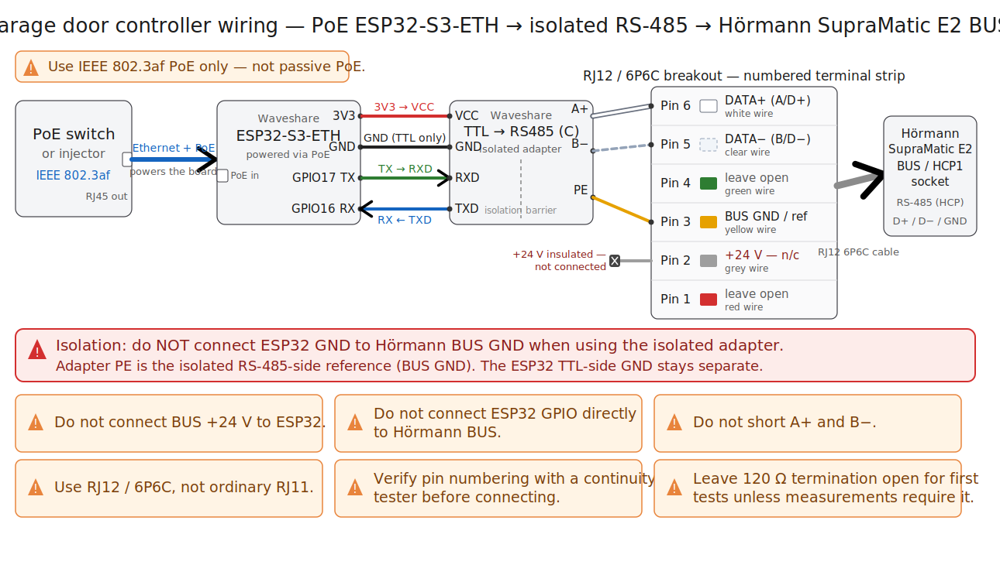

# Hardware Wiring

## Wiring Diagram

Use this diagram as a visual wiring reference. Still verify RJ12 pin numbering and cable continuity on your exact cable before connecting the opener.

## BUS Pinout

Use an RJ12 / 6P6C plug or breakout. Verify pin numbering on your exact cable before connecting anything.

| BUS pin | Function | Recommended connection |
| --- | --- | --- |
| 1 | Unused / unknown | Leave open |
| 2 | +24 V DC | Leave disconnected for USB-C or PoE power |
| 3 | BUS GND / RS-485 reference | Adapter RS-485-side reference |
| 4 | Unused / unknown | Leave open |
| 5 | RS-485 DATA- / B / D- | Adapter B- |
| 6 | RS-485 DATA+ / A / D+ | Adapter A+ |

## Waveshare TTL TO RS485 (C)

The known working setup uses the isolated Waveshare TTL TO RS485 (C) adapter.

| ESP32-S3-ETH / adapter | Connection |
| --- | --- |
| 3V3 | Adapter VCC |
| ESP32 GND | Adapter TTL-side GND only |
| GPIO17 TX | Adapter RXD |
| GPIO16 RX | Adapter TXD |
| Adapter A+ | BUS pin 6 |
| Adapter B- | BUS pin 5 |
| Adapter PE | BUS pin 3 |

On this adapter, `TXD` is the adapter's TTL transmit output and goes to ESP32 RX. `RXD` is the adapter's TTL receive input and goes to ESP32 TX.

Do not tie ESP32 GND to BUS pin 3 when using the isolated adapter. Use adapter `PE` as the isolated RS-485-side signal reference and connect it only to BUS pin 3.

## Example Cable Color Map

This is one verified cable only. Do not assume your cable uses the same colors.

| Wire color | RJ12 pin | Connect to |
| --- | --- | --- |
| Red | 1 | Leave open |
| Grey | 2 | Leave open / insulate, +24 V |
| Yellow | 3 | Adapter PE |
| Green | 4 | Leave open |
| Clear | 5 | Adapter B- |
| White | 6 | Adapter A+ |

## Termination

Leave the adapter terminator open for first tests. With all power disconnected, measure A/B resistance on the connected bus:

- About `120 ohm`: one terminator is present.
- About `60 ohm`: two terminators are present.
- Much lower: likely a wiring fault or over-termination.

Enable the adapter terminator only if this adapter is physically at an unterminated end of the RS-485 segment.

## PoE

Use only IEEE 802.3af PoE power for the Waveshare board/module. Do not use passive PoE. When powered by PoE, leave BUS pin 2 disconnected.

## ESP32 Pins

The main config uses:

- GPIO16: UART RX
- GPIO17: UART TX

Do not use GPIO9, GPIO10, GPIO11, GPIO12, GPIO13, or GPIO14 for RS-485 because they are used by the W5500 Ethernet chip.
