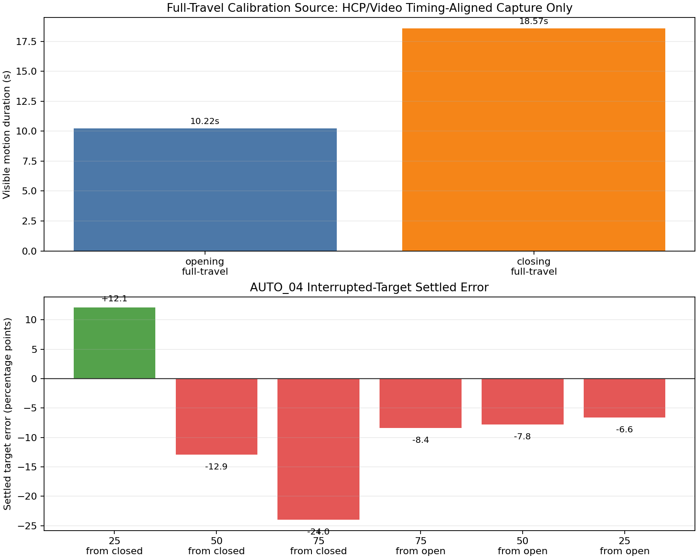
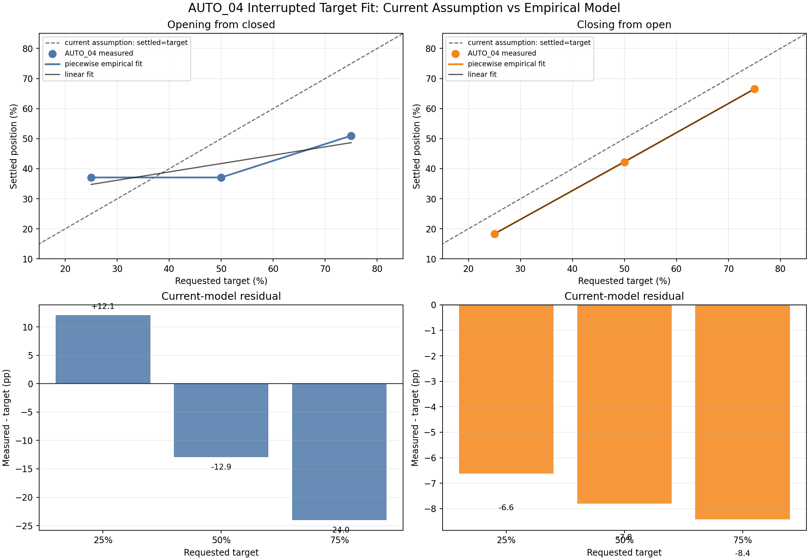
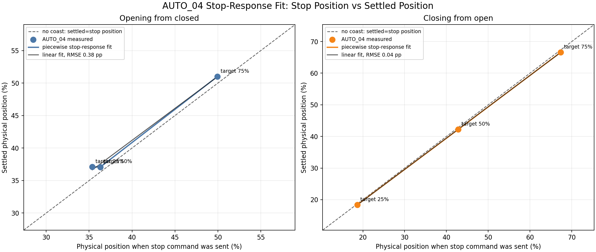
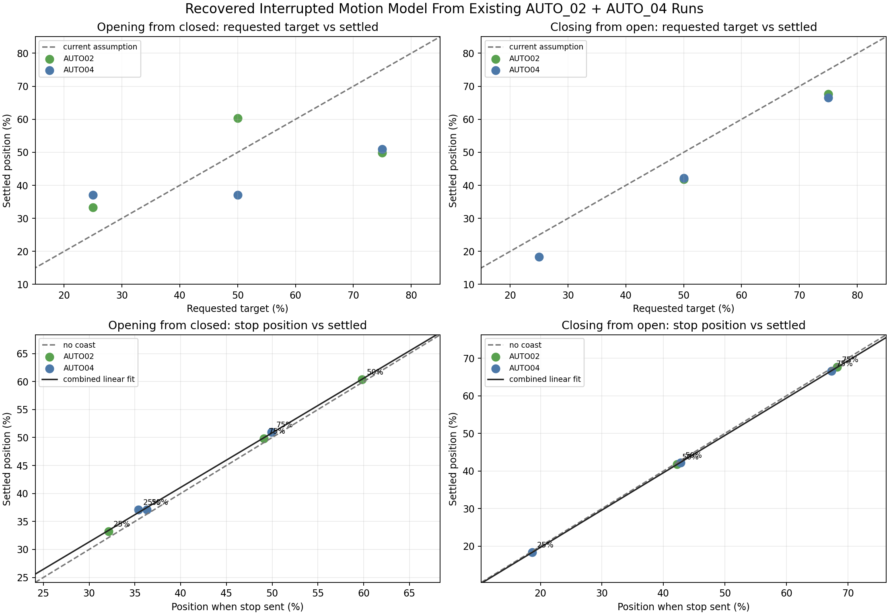

# Motion Model Fit Inputs - 2026-05-27

This report uses the earlier timing-aligned full-travel capture as the only full-open/full-close calibration source. AUTO_04 is treated only as an interrupted-position-target run. Its reset/end commands are not used as full-travel calibration observations.

## Sources Used

- Full-travel timing-aligned capture: `uncommitted-capture-bundles/hcp-timing-calibration/hcp-video-timing-alignment.json`
- Interrupted target run: `docs/research/analysis/phone-sync-auto04-20260527/summary.json`
- AUTO_04 video-derived position samples: `docs/research/analysis/phone-sync-auto04-20260527/auto04_progress_5fps.csv`

## Full-Travel Calibration

| Direction | Command to HCP endpoint | Visible motion duration | Combined offset |
| --- | ---: | ---: | ---: |
| opening | 12.825s | 10.215s | 2.610s |
| closing | 22.274s | 18.565s | 3.709s |

## AUTO_04 Interrupted Stop Observations

These rows describe the behavior we need for percentage targets: where the door was when the firmware sent stop, and where it finally settled.

| Step | Target | Stop delay | Position at stop | Settled position | Error | Settle after stop |
| --- | ---: | ---: | ---: | ---: | ---: | ---: |
| target_25_from_closed | 25% | 5.749s | 35.4% | 37.1% | +12.1 pp | 0.315s |
| target_50_from_closed | 50% | 8.211s | 36.3% | 37.1% | -12.9 pp | 0.274s |
| target_75_from_closed | 75% | 10.402s | 49.9% | 51.0% | -24.0 pp | 0.253s |
| target_75_from_open | 75% | 6.257s | 67.3% | 66.6% | -8.4 pp | 0.254s |
| target_50_from_open | 50% | 10.443s | 42.8% | 42.2% | -7.8 pp | 0.247s |
| target_25_from_open | 25% | 14.880s | 18.7% | 18.4% | -6.6 pp | 0.113s |

## Model Implication

The door needs two models, not one:

1. Planned endpoint profile for full open/full close. This uses the timing-aligned capture and remains corrected by HCP open/closed endpoint bits.
2. Interrupted target profile for percentage positions. This must predict the final settled position after an abrupt stop command. It should not use the planned endpoint S-curve directly, because the motor does not get to execute its planned deceleration profile.

A practical firmware implementation is to compute target stops from `predicted_settled_position`, not from instantaneous estimated position:

```text
predicted_settled_position = interrupted_profile(position_at_stop, velocity_at_stop, direction)
stop when predicted_settled_position reaches requested target
```

For the first implementation, the interrupted profile can be a small empirical table per direction/start endpoint derived from AUTO_04 stop observations. Later captures can add more points without changing the protocol layer.



## Fit Quality

The current firmware model effectively assumes that the door settles at the requested target. AUTO_04 shows that this is not true for interrupted targets.

| Class | Model | RMSE | Max error | Notes |
| --- | --- | ---: | ---: | --- |
| opening_from_closed | `current_target_equals_settled_assumption` | 17.22 pp | 24.01 pp | current firmware effectively expects settled position to match requested target |
| opening_from_closed | `linear_stop_position_to_settled: settled=0.983005*stop_position+1.874637` | 0.38 pp | 0.48 pp | first practical interrupted-stop response model |
| opening_from_closed | `piecewise_empirical_lookup` | 0.00 pp | 0.00 pp | passes through AUTO_04 training points exactly; needs another run to validate interpolation/extrapolation |
| closing_from_open | `current_target_equals_settled_assumption` | 7.65 pp | 8.42 pp | current firmware effectively expects settled position to match requested target |
| closing_from_open | `linear_stop_position_to_settled: settled=0.990061*stop_position+-0.122683` | 0.04 pp | 0.06 pp | first practical interrupted-stop response model |
| closing_from_open | `piecewise_empirical_lookup` | 0.00 pp | 0.00 pp | passes through AUTO_04 training points exactly; needs another run to validate interpolation/extrapolation |

The piecewise empirical model fits the AUTO_04 points exactly because it uses those points as the calibration table. That is useful for firmware implementation, but it is not yet validation. The next run should test interpolation points between these targets.





## Recovered Model From Existing Runs

A new run is not strictly required for a first model. We can recover stop-response observations from AUTO_02 and AUTO_04 because both contain command timestamps, stop timestamps, and video-derived physical positions. AUTO_02 `target_25_from_open` is excluded because the recorded video did not contain a valid movement away from open.

| Class | Model | N | RMSE | Max error |
| --- | --- | ---: | ---: | ---: |
| opening_from_closed | `current_target_equals_settled_assumption` | 6 | 16.83 pp | 25.18 pp |
| opening_from_closed | `linear_stop_position_to_settled: settled=0.975103*stop_position+2.083240` | 6 | 0.30 pp | 0.52 pp |
| closing_from_open | `current_target_equals_settled_assumption` | 5 | 7.69 pp | 8.42 pp |
| closing_from_open | `linear_stop_position_to_settled: settled=0.992568*stop_position+-0.163212` | 5 | 0.10 pp | 0.12 pp |


Cross-run validation is the important caveat: closing-from-open generalizes well across AUTO_02 and AUTO_04, while opening-from-closed is less stable because those runs were made under different firmware behavior and the bad estimator influenced the tested stop times. The recovered model is still good enough for a provisional firmware table, especially for closing, but opening should be clamped/conservative until another capture validates interpolation.


