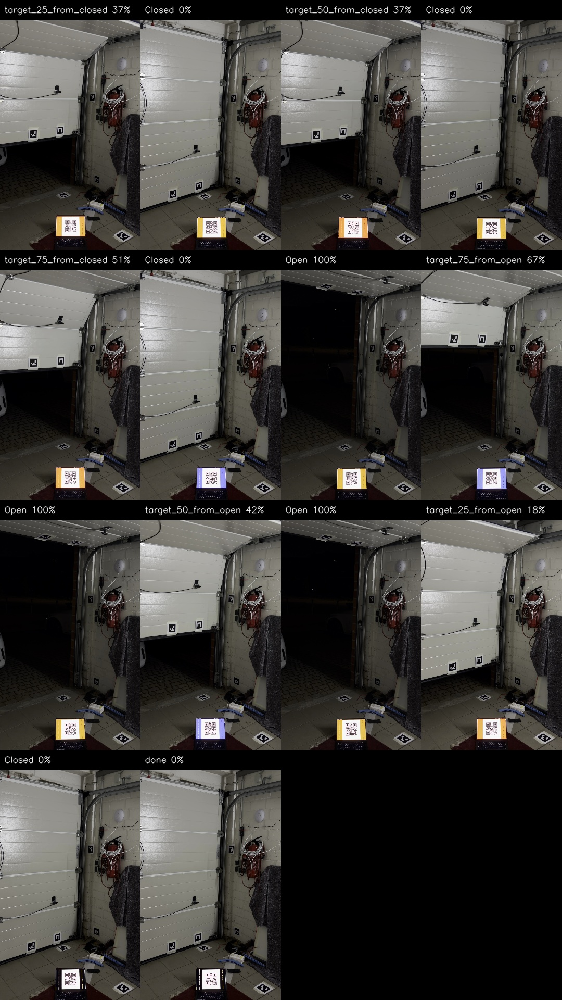
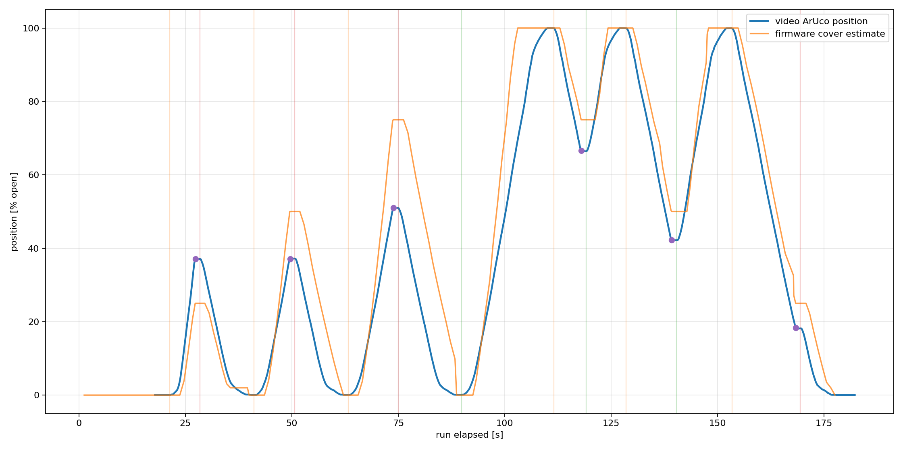
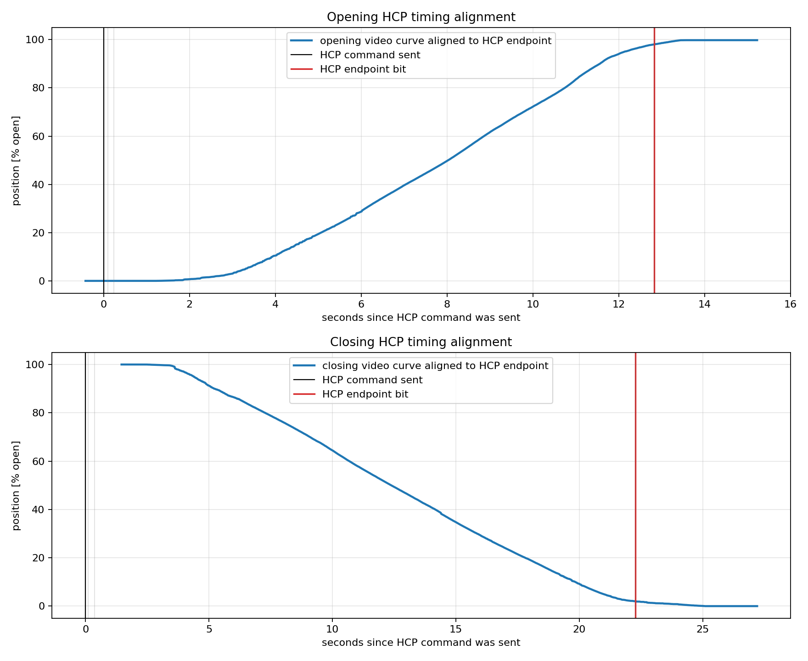

# Tools

This directory contains the Python helpers used to build, test, capture, and calibrate the SupraMatic E2 ESPHome firmware. Run them through `uv` from the repository root so the pinned dependencies and console scripts are used.

## Script Index

| Command | Source | Purpose |
| --- | --- | --- |
| `uv run garage-phone-sync` | [run_phone_video_sync_capture.py](run_phone_video_sync_capture.py) | Fullscreen phone-video sync display, HCP command runner, and ESP persistent-log coordinator |
| `uv run garage-decode-phone-sync-video` | [decode_phone_sync_video.py](decode_phone_sync_video.py) | Decode the fullscreen QR timecode from a phone video |
| `uv run garage-fetch-hcp2-reference` | [fetch_hcp2_reference.py](fetch_hcp2_reference.py) | Fetch and normalize the pinned public HCP2 reference corpus into ignored `captures/hcp2/` |
| `uv run garage-analyze-aruco-video` | [analyze_garage_aruco_video.py](analyze_garage_aruco_video.py) | Extract door motion curves from ArUco marker videos |
| `uv run garage-hcp-timing-calibration` | [run_hcp_timing_calibration.py](run_hcp_timing_calibration.py) | Run a normal HCP open/close timing capture through ESPHome |
| `uv run garage-analyze-hcp-timing` | [analyze_hcp_timing.py](analyze_hcp_timing.py) | Align persistent HCP logs with previously extracted motion curves |
| `uv run garage-init-secrets` | [init_secrets.py](init_secrets.py) | Generate local ESPHome API, OTA, and proxy secrets |
| `uv run garage-supramatic-sim` | [supramatic_sim](supramatic_sim/) | Virtual SupraMatic 4 HCP2 master for closed-loop host and HIL tests |
| `uv run garage-hcp2-hil-la` | [hcp2_hil_la.py](hcp2_hil_la.py) | Capture, decode, and verify HCP2 HIL logic-analyzer traces for DE/TX reset-safety and zero-gap UART checks |
| `uv run garage-hcp2-hil-load` | [hcp2_hil_load.py](hcp2_hil_load.py) | Run HCP2 HIL simulator scenarios while host/Wi-Fi/API load commands are active |
| `uv run garage-hcp2-closeout` | [hcp2_closeout.py](hcp2_closeout.py) | Run scripted HCP2 HIL closeout plans with simulator, load, command, and optional LA verdicts |
| `uv run garage-hcp2-support-bundle` | [hcp2_support_bundle.py](hcp2_support_bundle.py) | Collect Series 4 tester `/health`, `/support`, `/stats`, and RAM protocol-log files from the ESP HTTP debug port |
| `uv run garage-hcp2-debug-browser-e2e` | [hcp2_debug_browser_e2e.py](hcp2_debug_browser_e2e.py) | Manual/HIL Playwright browser check for the Series 4 debug web UI, live WebSocket log, reconnect path, frontend cache download, and optional soak |
| `uv run garage-build-hcp2-lp-blob-ci` | [build_hcp2_lp_blob_ci.py](build_hcp2_lp_blob_ci.py) | Build `firmware/hcp2-lp` with the same `espressif/idf:release-v5.5` Docker image used by CI and refresh the checked-in ESPHome LP blob |
| `uv run garage-update-hcp2-lp-blob` | [update_hcp2_lp_blob.py](update_hcp2_lp_blob.py) | Low-level generate/check helper for an already built CI Docker LP binary; use `garage-build-hcp2-lp-blob-ci` for normal updates |
| `uv run garage-test-wizard` | [garage_test_wizard.py](garage_test_wizard.py) | Guided manual Home Assistant position tests using measured clear-opening height |
| `uv run garage-generate-aruco-markers` | [generate_aruco_marker_pdfs.py](generate_aruco_marker_pdfs.py) | Generate printable ArUco marker PDFs |
| `uv run garage-hcp-proxy-client` | [hcp_proxy_client.py](hcp_proxy_client.py) | Laptop-side RS-485 proxy experiments |

## HCP2 HIL Closeout

`garage-hcp2-closeout` has built-in presets for the repeatable C6/RS-485 bench checks:

```bash
uv run garage-hcp2-closeout --serial /dev/serial/by-id/usb-1a86_USB_Single_Serial_5ACC032762-if00 \
  --preset basic --output-dir captures/hcp2/closeout/basic --output captures/hcp2/closeout/basic/report.json

uv run garage-hcp2-closeout --serial /dev/serial/by-id/usb-1a86_USB_Single_Serial_5ACC032762-if00 \
  --preset la --output-dir captures/hcp2/closeout/la --output captures/hcp2/closeout/la/report.json

uv run garage-hcp2-closeout --serial /dev/serial/by-id/usb-1a86_USB_Single_Serial_5ACC032762-if00 \
  --preset ota-restart --esp-host 192.168.10.156 --esp-device 192.168.10.156 \
  --output-dir captures/hcp2/closeout/ota-restart --output captures/hcp2/closeout/ota-restart/report.json

uv run garage-hcp2-closeout --serial /dev/serial/by-id/usb-1a86_USB_Single_Serial_5ACC032762-if00 \
  --preset full --esp-host 192.168.10.156 --esp-device 192.168.10.156 \
  --skip-esphome-compile --sigrok-cli /tmp/hcp2-la-work/.bin/sigrok-cli \
  --output-dir captures/hcp2/closeout/full --output captures/hcp2/closeout/full/report.json
```

The `la` preset captures the current bench mapping (`RX=D0`, `TX=D2`, `/RE=D5`, `DE=D7`;
the RS-485 bus legs are also wired as `A=D1`, `B=D3` for manual inspection)
and verifies DE hold time, TX gating, `/RE` gating, UART decode, and status-counter
continuity. The `ota-restart` preset runs simulator traffic while an ESPHome OTA upload
and native-API restart button press execute, then records both command tails and bus
verdicts in one JSON report. API keys are read from `configs/secrets.yaml` by secret
name, not embedded into the generated command line.

The `full` preset is the current closeout baseline. It runs `basic`, `la`, and
`ota-restart` in one report; the latest 2026-06-13 v10 run passed runtime
1000/1000, fault-recovery 251/251, LA 160/160, OTA 500/500, and API restart
350/350 with zero misses. `garage-hcp2-closeout` preflights the LA executable
before opening the serial bus. If `sigrok-cli` is not on `PATH`, pass
`--sigrok-cli /path/to/sigrok-cli` or set `HCP2_SIGROK_CLI`.

## HCP2 Hostile HIL Load

Use `garage-hcp2-hil-load` directly when the goal is a longer soak with Wi-Fi
and API pressure instead of the fixed closeout matrix:

```bash
uv run garage-hcp2-hil-load --serial /dev/serial/by-id/usb-1a86_USB_Single_Serial_5ACC032762-if00 \
  --preset hostile --esp-host 192.168.10.156 \
  --cycles 2000 --repeat 3 --settle-s 2 \
  --trace captures/hcp2/hil-load/hostile.jsonl \
  --output captures/hcp2/hil-load/hostile.json
```

The hostile preset adds a ping stream and repeated ESPHome native-API TCP
connects while the same virtual SupraMatic master verifies poll replies. With
`--repeat`, the JSON output becomes an aggregate report with total polls,
misses, max consecutive misses, and worst latency across runs. Per-run traces
are written as `*.runNN.jsonl`. When `--esp-host` is set, the runner also samples
the tester debug `/health` endpoint at the end of each run. The firmware health
verdict remains visible, but the HIL report classifies an RX-starvation-only
health flag during intentional fault injection as a warning instead of a bus
continuity failure; missed polls, stale bus state, tx aborts, collisions, loop
overruns, stuck DE, and non-RX LP health flags still fail the run.

The same HIL runner can execute named SupraMatic scenarios and schedule ESPHome
native-API commands while the RS-485 master keeps polling:

```bash
uv run garage-hcp2-hil-load --serial /dev/serial/by-id/usb-1a86_USB_Single_Serial_5ACC032762-if00 \
  --esp-host supramatic-4-tester.local \
  --esp-expected-name supramatic-4-tester \
  --esp-cover-object-id garage_door_hcp2_tester \
  --esp-button-object-id half=garage_door_hcp2_tester_half_command \
  --esp-button-object-id vent=garage_door_hcp2_tester_vent_command \
  --esp-button-object-id light=garage_door_hcp2_tester_light_command \
  --scenario goto-position --goto-position-raw 80 \
  --expect-button open --expect-button stop \
  --output captures/hcp2/hil-load/goto-position.json
```

When native-API entities are not configured, named scenarios automatically use emulated
ESPHome commands: the simulator records the accepted command and advances only the
virtual door model. This is useful for HIL poll-reliability and movement-model coverage
against a serial DUT, but it is not proof that the firmware emitted the matching HCP2
button bytes. Use `--command-mode native-api` plus `--expect-button` for that.

```bash
uv run garage-hcp2-hil-load --serial /dev/serial/by-id/usb-1a86_USB_Single_Serial_5ACC032762-if00 \
  --scenario open-from-closed --command-mode emulated \
  --door-travel-cycles 260 --cycles 320 \
  --output captures/hcp2/hil-load/emulated-open.json
```

For 24h reliability soaks, do not enable the full per-poll `--trace`; it grows
too large to be useful. Run at real cadence with low-volume progress snapshots
and abort on the first missed status poll:

```bash
uv run garage-hcp2-hil-load --serial /dev/serial/by-id/usb-1a86_USB_Single_Serial_5ACC032762-if00 \
  --preset hostile --esp-host 192.168.10.156 \
  --speed-factor 1 --duration-hours 24 --abort-on-miss \
  --progress-output captures/hcp2/soak-24h/progress.jsonl \
  --output captures/hcp2/soak-24h/report.json
```

The progress file is JSONL and fsynced after every snapshot, so a detached bench
run still leaves poll/reply/miss counters if the SSH session or runner dies.

For logic-analyzer sidecars, `garage-hcp2-hil-la verify` tolerates a capture
ending while DE is already high and reports that as a trailing boundary window.
Use `--require-final-de-low` for a deliberately strict capture-end check.

## HCP2 Series 4 Tester Bundles

The Series 4 tester image exposes RAM-only debug endpoints on port `80`, with
the browser page streaming the live log over `ws://.../hcp2_log/ws`. The
browser page's `Download JSON` button exports its own bounded frontend cache
(newest 30 minutes / 100 MiB); the support-bundle tool still downloads the ESP RAM
ring directly. Prepare a fresh logging window before reproducing an issue, then
stop and collect the bundle:

```bash
uv run garage-hcp2-support-bundle --host supramatic-4-tester.local --action start
uv run garage-hcp2-support-bundle --host supramatic-4-tester.local --action stop-and-collect
```

The tool writes under ignored `captures/hcp2/support-bundle-*` by default and
prints the exact bundle directory. See [docs/hcp2-series4-tester.md](../docs/hcp2-series4-tester.md).

For a real browser check of the debug UI, run Playwright manually against a
live tester. This is a HIL-only gate and is intentionally not part of normal CI:

```bash
uv run --with playwright garage-hcp2-debug-browser-e2e --host supramatic-4-tester.local \
  --browser-channel chrome --screenshot captures/hcp2/debug-browser-e2e.png \
  --report captures/hcp2/debug-browser-e2e.json
```

## Visual Calibration Workflow

This workflow is optional. It is not needed to build, flash, wire, or use the opener as a normal Home Assistant garage-door cover. Skip it if you only want open, close, stop, light, endpoint state, diagnostics, and HomeKit Bridge.

The visual workflow is for one narrow problem: making percentage position control more accurate. Because the HCP1 status broadcasts do not expose a trustworthy continuous position, the firmware estimates position from timing. The marker/video process is a way to measure that timing instead of guessing.

It is also fair to call this overengineered for most installs. It combines phone video, printed ArUco tracking markers, a fullscreen QR timecode, and ESP protocol logs so the motion model can be audited later. The latest successful visual run is `AUTO_04` from 2026-05-27.

The capture measures:

- The visible opening and closing motion curves.
- The delay between command send, visible movement, and the HCP endpoint report.
- The difference between an intermediate stop position and the final settled door position.

### 1. Record A Synchronized Video

The phone records the physical door, printed ArUco markers, and the MacBook fullscreen QR timecode in one shot. The ESP captures the HCP persistent protocol log at the same time.

```bash
uv run garage-phone-sync \
  --sequence position_targets_no_calibration \
  --yes
```

Use `--dry-run` first to check the fullscreen layout without moving the opener.

<p align="center">
  
</p>

The contact sheet above shows the important calibration ingredients:

- ArUco markers attached to the moving door segment and fixed references.
- A large QR timecode on the MacBook screen for video-to-run alignment.
- Command milestones such as `target_25_from_closed`, `target_75_from_open`, and endpoint resets.

### 2. Decode Time And Marker Position

The QR decoder maps video time to ESP run time. For `AUTO_04`, the accepted QR samples fitted:

```text
run_elapsed_s = 0.99997635 * video_time_s + 17.862
```

The ArUco pass then extracts the physical door position. The timeline below compares video-derived position with the firmware estimate that was active during the run.

<p align="center">
  
</p>

### 3. Align Full-Travel Timing

Full open and full close use the endpoint motion model. The timing-aligned full-travel capture measured visible motion separately from the HCP command-to-end-state timing:

| Direction | Visible motion | Command to HCP endpoint | Combined offset |
| --- | ---: | ---: | ---: |
| Opening | `10.215 s` | `12.825 s` | `2.610 s` |
| Closing | `18.565 s` | `22.274 s` | `3.709 s` |

<p align="center">
  
</p>

### 4. Fit Interrupted-Stop Behavior

Percentage targets do not use the same profile as full open or full close. For intermediate positions, the opener is stopped abruptly and then settles slightly. The firmware therefore predicts the final settled position from the stop position.

Recovered from the timing-aligned `AUTO_02` and `AUTO_04` runs:

| Direction | Stop-response model | Fit quality |
| --- | --- | ---: |
| Opening from closed | `settled = 0.975103 * stop + 0.0208324` | `0.30 pp` RMSE |
| Closing from open | `settled = 0.992568 * stop - 0.00163212` | `0.10 pp` RMSE |

<p align="center">
  
</p>

The top row shows why the first naive model was wrong: requested target and final settled position are not the same for abrupt stops. The bottom row is the model the firmware uses: stop position versus settled position.

### 5. Apply The Calibration

The calibrated values live in [configs/supramatic-e2.yaml](../configs/supramatic-e2.yaml) and are documented in [docs/time-based-position.md](../docs/time-based-position.md). The key behavior is:

- Full open/close uses the measured endpoint curves and waits for HCP endpoint confirmation.
- Intermediate targets use the interrupted-stop model.
- Exact `0%` closed is only published after the HCP closed bit is decoded.
- The persistent protocol log is PSRAM-only for these captures, so repeated calibration runs do not wear ESP flash.

## Reference Artifacts

| Artifact | What to inspect |
| --- | --- |
| [phone-sync-auto04-20260527](../docs/research/analysis/phone-sync-auto04-20260527/README.md) | Latest successful synchronized phone-video run |
| [motion-model-fit-20260527](../docs/research/analysis/motion-model-fit-20260527/README.md) | Stop-response model and fit metrics |
| [garage-door-motion-20260527](../docs/research/analysis/garage-door-motion-20260527/README.md) | Full-travel opening/closing curves and HCP timing alignment |
